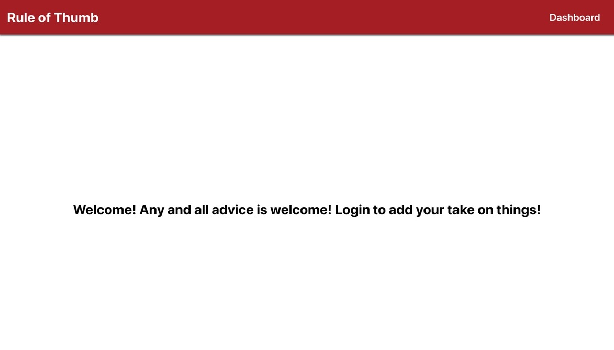
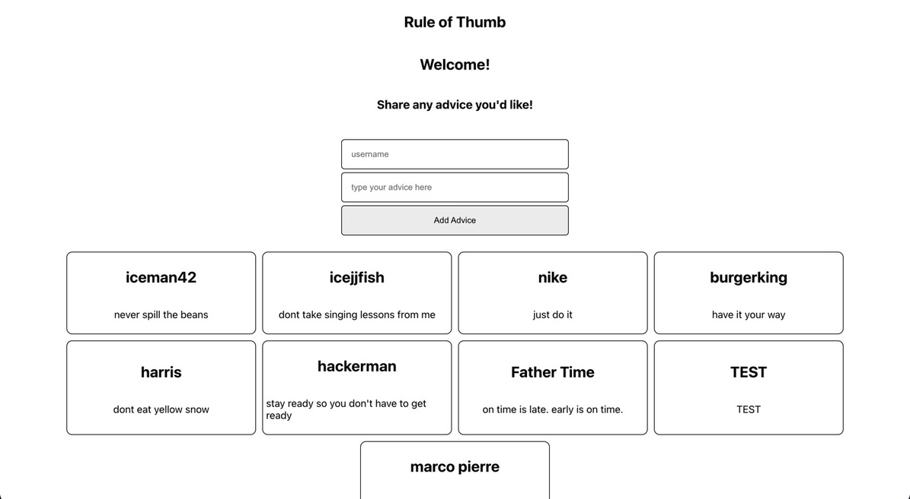

# Introduction
This a de-coupled, full-stack application, that records advice that users submit.

## Technologies Used
- React
- Node 
- Express 
- Mongoose 
- MongoDB
## Getting Started
This is my trello board I made to plan out my project. 
https://trello.com/b/IdMEBeDi/project-3
And here is the deployed app link.
https://ruleofthumbga.netlify.app/
## Unsolved Problems
I have to solve an authentication problem with Google Firebase.
## Future Enhancements
- I want to have a user be able to have FULL CRUD capability. 
- I want a user's post to be tagged with their username from when the authenticate yourself.
- I want a user be authenticated in order to post a piece of advice.